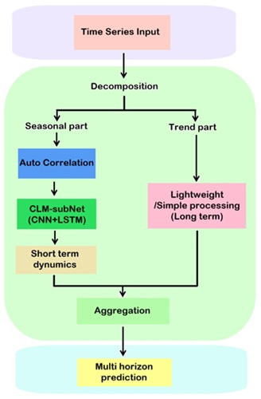
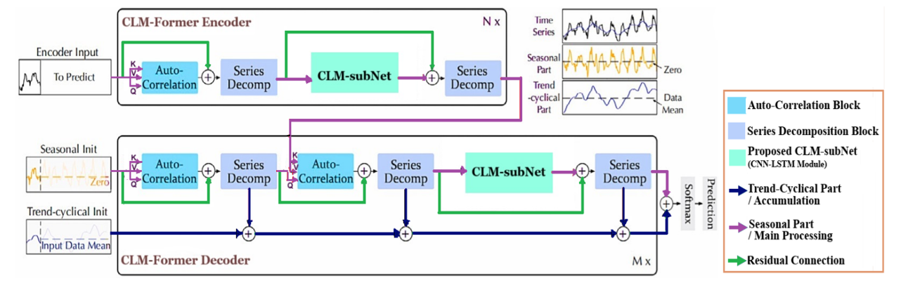
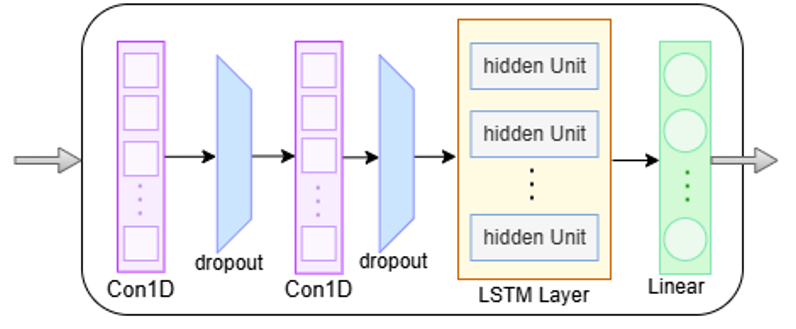

# CLM-Former: Enhancing Multi-Horizon Load Forecasting in Smart Microgrids

This repository provides the official implementation of the paper:

**CLM-Former for Enhancing Multi-Horizon Time Series Forecasting and Load Prediction in Smart Microgrids Using a Robust Transformer-Based Model**

📌 *Scientific Reports (Nature Portfolio) – Q1 Journal*  
📌 *Open Access*

---

## 📄 Paper Information

- **Journal:** Scientific Reports (Nature)
- **DOI:** https://doi.org/10.1038/s41598-025-34870-y
- **Full Text (Open Access):**  
  https://www.nature.com/articles/s41598-025-34870-y
- **Authors:**  
  - S. Mozhgan Rahmatinia  
  - Seyed-Majid Hosseini  
  - Seyed-Amin Hosseini-Seno  

---

## 🧠 Abstract

Accurate multi-horizon load forecasting is a cornerstone of efficient and reliable smart microgrid operation, particularly in residential environments characterized by strong seasonality and abrupt short-term fluctuations.

To address the limitations of existing Transformer-based forecasting models, this work proposes **CLM-Former**, a novel hybrid deep learning architecture that enhances the Autoformer framework by integrating a **CNN–LSTM subnetwork (CLM-subNet)** directly into the decomposition-based Transformer blocks.

CLM-Former effectively captures:
- Long-term periodic patterns via frequency-domain autocorrelation
- Short-term and localized fluctuations via hierarchical time-domain modeling

Extensive experiments on real-world residential electricity consumption datasets demonstrate that CLM-Former consistently outperforms state-of-the-art Transformer-based and deep learning models across multiple forecasting horizons, while preserving computational efficiency.

---

## ✨ Key Contributions

- 🔹 **Architectural Innovation:**  
  Replaces the point-wise Feed-Forward Network in Autoformer with a learnable **CNN–LSTM subnetwork** operating on the seasonal component.

- 🔹 **Hybrid Temporal Modeling:**  
  Combines frequency-domain autocorrelation (long-term periodicity) with time-domain convolutional and recurrent modeling (short-term dynamics).

- 🔹 **Multi-Horizon Forecasting:**  
  Accurate predictions for short-, medium-, and long-term horizons (96, 192, 336 steps).

- 🔹 **Global Multivariate Forecasting:**  
  A single model jointly forecasts electricity consumption for **321 residential households**.

- 🔹 **Generalizability:**  
  Validated on Electricity, Traffic, ETTm2, and Weather benchmark datasets.

- 🔹 **Efficiency-Preserving Design:**  
  Maintains Autoformer’s \(O(L \log L)\) complexity with minimal inference overhead.

---

## 🏗️ CLM-Former Architecture

CLM-Former follows an **Encoder–Decoder Transformer architecture** with progressive time series decomposition.

### 🔹 Core Components

1. **Series Decomposition (Layer-wise)**  
   Splits the input into:
   - Seasonal component
   - Cyclical–trend component

2. **Autocorrelation-Based Attention**  
   Captures long-range dependencies and dominant periodic patterns in the frequency domain.

3. **CLM-subNet (CNN + LSTM)**  
   Applied exclusively to the seasonal component to:
   - Extract local high-frequency patterns (CNN)
   - Model sequential temporal dependencies (LSTM)

4. **Progressive Aggregation**  
   Trend components are accumulated while refined seasonal signals generate multi-horizon forecasts.

---

## 🖼️ Model Overview

Conceptual overview of CLM-Former illustrating decomposition, autocorrelation, and CLM-subNet integration.

Encoder–Decoder architecture with CLM-subNet replacing the Feed-Forward Network.

Internal structure of the proposed CNN–LSTM CLM-subNet.

📊 Datasets
Primary Dataset

Electricity Dataset

321 residential households

Hourly resolution

3 years (2016–2019)

Additional Benchmarks

Traffic

ETTm2

Weather

Data Split:

70% Training

10% Validation

20% Testing

📈 Evaluation Metrics

Mean Squared Error (MSE)

Mean Absolute Error (MAE)

Statistical significance validated via:

Paired t-test

Wilcoxon signed-rank test

🧪 Experimental Results

Consistent superiority over:

Autoformer

Crossformer

Informer

Reformer

Transformer

CNN-LSTM, LSTM, TCN, SCINet, TiDE

Strong gains at longer horizons (336 steps)

Improved accuracy without sacrificing inference speed

Qualitative comparison of CLM-Former against Transformer-based baselines.

⚙️ Computational Efficiency

Retains 
𝑂
(
𝐿
log
⁡
𝐿
)
complexity

Comparable inference time to Autoformer

Fewer parameters than convolution-only Autoformer variants due to LSTM bottleneck design

🖥️ Environment

Python 3.11

PyTorch ≥ 2.2

NumPy, Pandas

GPU: NVIDIA RTX / T4 (tested)

